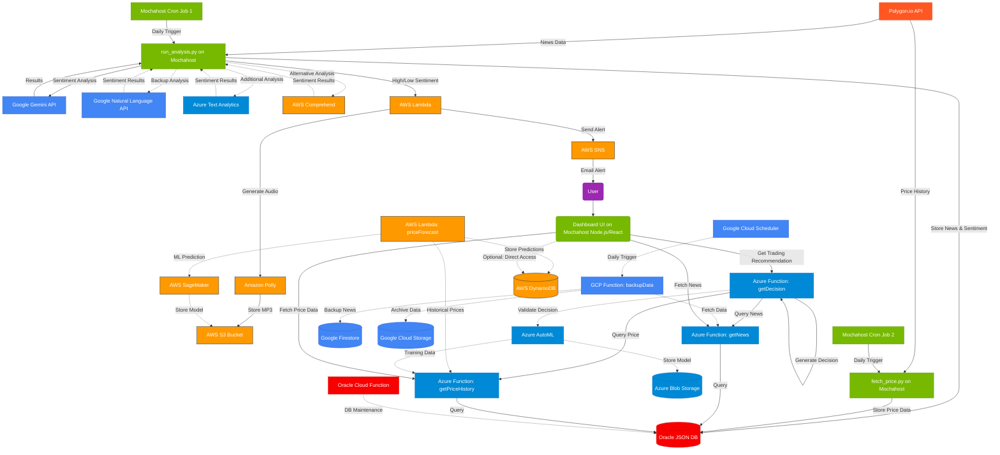

# OptionsTrader

A comprehensive stock options analysis application that leverages free cloud resources and AI services to analyze market data and provide trading recommendations.

## Architecture

## Overview

OptionsTrader is a multi-cloud stock options analysis application that leverages free tiers of AWS, Azure, Google Cloud, and Oracle Cloud to provide comprehensive market analysis and trading recommendations. The application collects news and price data, performs sentiment analysis using various AI services, and displays the results in an interactive dashboard.

## Key Features

- **Data Collection**: Automated collection of stock news and price history from Polygon.io API
- **AI-Powered Analysis**: Sentiment analysis using Google Gemini API, with backup options from AWS Comprehend and Azure Text Analytics
- **Multi-Cloud Storage**: Primary data storage in Oracle Cloud's Always Free JSON Database, with backups in Google Firestore and AWS DynamoDB
- **Serverless Computing**: API endpoints distributed across Azure Functions and AWS Lambda to stay within free tier limits
- **Automated Alerts**: Voice alerts for significant market movements using AWS Polly and SNS
- **Interactive Dashboard**: React-based frontend with Chart.js visualizations

## Cloud Resources Utilized

### AWS Free Tier
- Lambda for serverless functions
- S3 for media storage
- DynamoDB for backup/cache
- Comprehend for sentiment analysis
- Polly for voice alerts
- SNS for notifications
- CloudWatch for monitoring

### Azure Free Tier
- Azure Functions for API endpoints
- Cosmos DB for secondary database
- Blob Storage for backups
- Text Analytics for sentiment analysis
- Application Insights for monitoring

### Google Cloud Free Tier
- Cloud Functions for data processing
- Firestore for document storage
- Cloud Storage for archiving
- Natural Language API for sentiment analysis
- Cloud Scheduler for automation

### Oracle Cloud Free Tier
- Autonomous JSON Database for primary storage
- Cloud Functions for database maintenance

## Implementation Plan

The implementation is divided into several phases:

1. **Infrastructure Setup**: Setting up accounts and configuring free tier resources
2. **Data Collection**: Implementing scripts to gather news and price data
3. **Analysis Pipeline**: Setting up AI services for sentiment analysis
4. **API Layer**: Creating serverless functions to serve data
5. **Frontend**: Building the React-based dashboard
6. **Decision Engine**: Implementing the trading recommendation system
7. **Monitoring**: Setting up cross-cloud monitoring and alerting

For a detailed implementation plan, see [IMPLEMENTATION_PLAN.md](IMPLEMENTATION_PLAN.md).

## Getting Started

To deploy this project, follow these steps:

1. Clone this repository
2. Set up accounts with AWS, Azure, Google Cloud, and Oracle Cloud
3. Follow the setup instructions in [SETUP.md](SETUP.md)
4. Deploy the application components as described in [DEPLOYMENT.md](DEPLOYMENT.md)

## License

This project is licensed under the MIT License - see the [LICENSE](LICENSE) file for details.
