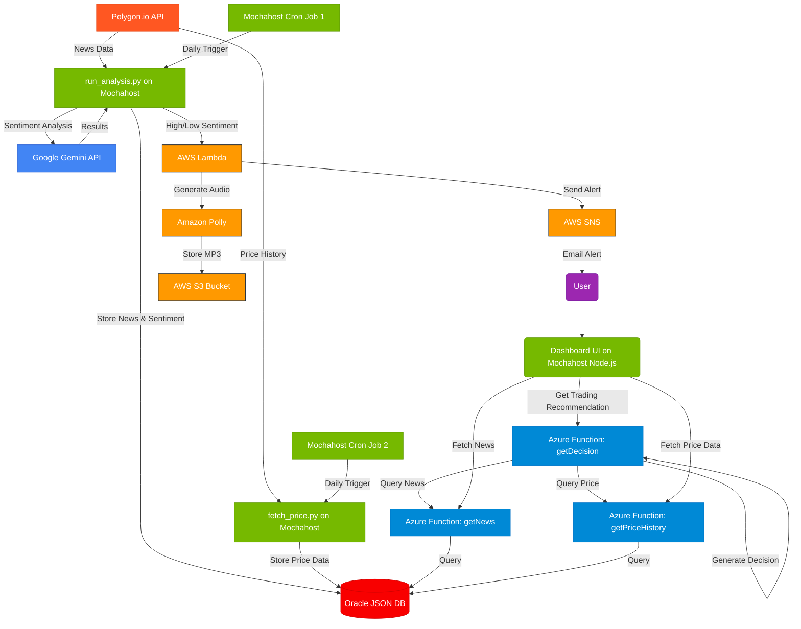

# OptionsTrader

A stock options analysis app that leverages free cloud resources and AI to analyze market data.

## Architecture


2. You can also add the implementation plan and timeline as separate markdown files in your repository:
   - Create a file called `IMPLEMENTATION_PLAN.md`
   - Create a file called `TIMELINE.md`
   - Copy the contents from the files I generated into these new files

3. To commit these files to your GitHub repository:
```bash
   git clone https://github.com/lexusolution/optionstrader.git
   cd optionstrader
   # Create the README.md file with the Mermaid diagram
   # Create the IMPLEMENTATION_PLAN.md file
   # Create the TIMELINE.md file
   git add .
   git commit -m "Add architecture diagram, implementation plan, and timeline"
   git push
```

GitHub now supports Mermaid diagrams natively in markdown, so the diagram will automatically render in your README.md file when viewed on GitHub.

Would you like me to help you with creating the other files for your repository or making any adjustments to the plan?
